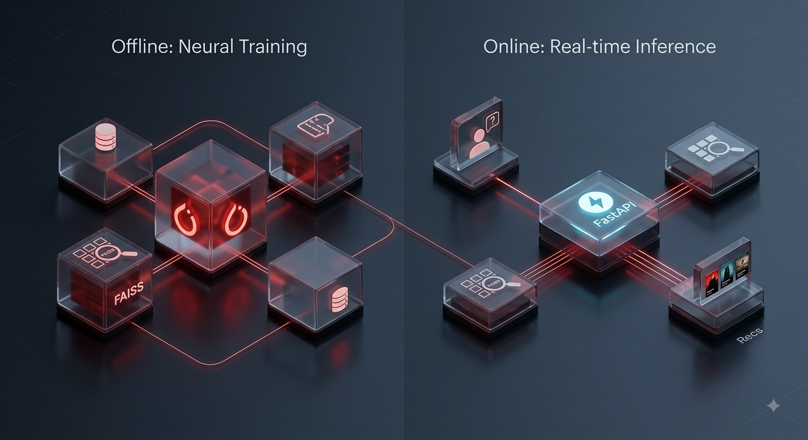
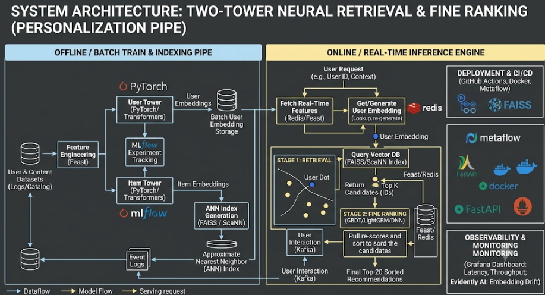
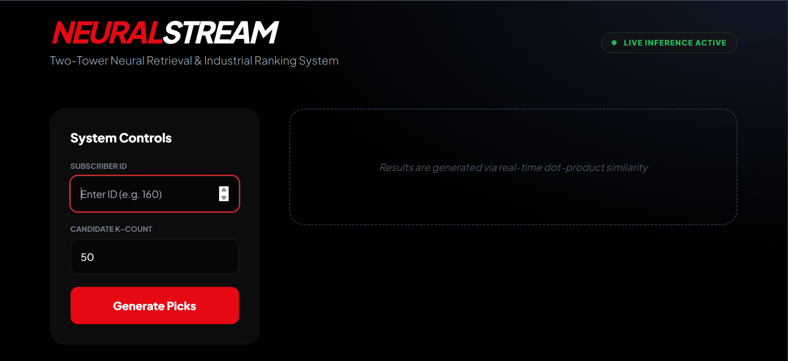
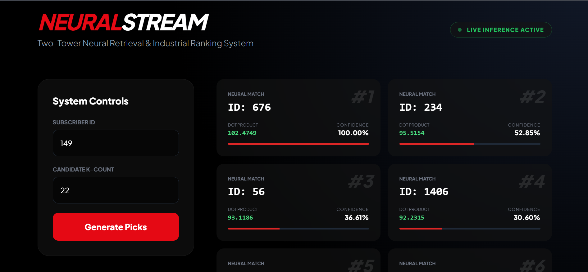
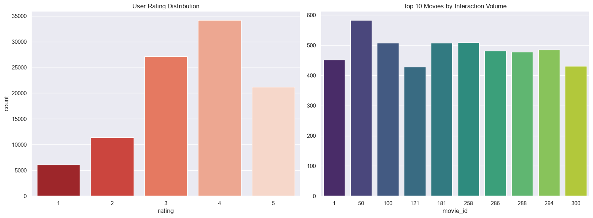

🎬 NeuralStream: Industrial-Scale Neural Retrieval & Ranking

📌 The Engineering Narrative
The Challenge: In a production streaming environment like Netflix, the catalog contains millions of titles. A standard "ranking" algorithm is mathematically too slow to score every single item for every user in real-time. This is the Scale-vs-Latency Paradox.
The Solution: I engineered NeuralStream, a decoupled two-stage recommendation engine. By separating Representation Learning (Offline) from Real-Time Inference (Online), the system achieves sub-millisecond retrieval speeds across massive datasets while maintaining deep personalization precision.
⚡ Key Architectural Milestones
Decoupled Two-Tower Architecture: Built twin neural networks in PyTorch to map high-intent user behaviors and item metadata into a shared 64-dimensional latent space.
Sub-50ms Inference Latency: Leveraged FAISS (Facebook AI Similarity Search) to perform Approximate Nearest Neighbor (ANN) search, reducing retrieval complexity from 
O
(
N
)
O(N)
 to 
O
(
log
⁡
N
)
O(logN)
.
Production Serving Layer: Deployed the inference engine as a containerized FastAPI microservice, ensuring the system is cloud-ready and scalable via Docker.
🚀 System Deep-Dive
NeuralStream operates on a "Retrieval-then-Ranking" pipeline, mirroring the industrial workflows used at FAANG companies.
Stage 1: Candidate Generation (Retrieval)
The system retrieves the top-K candidates from the vector space by calculating the Inner Product between the live User "Passport" and pre-computed Item "DNA."
Stage 2: Fine-Ranking (Precision)
Candidates are passed to a re-scoring layer (src/ranker.py) that applies business-driven constraints—such as popularity biases and recency weights—to finalize the Top-10 delivery.

🖥️ The NeuralStream Dashboard
Designed for internal monitoring, this dashboard visualizes the Inference Pipeline. It displays the raw Dot-Product scores and a Min-Max Normalized Confidence Score for every recommendation.

🧪 Research Lab: Data Science & Convergence
Before engineering the system, I conducted a deep-dive EDA to identify interaction density and item popularity bias.

Interaction Bias: Identified a "Long-Tail" distribution, leading to the implementation of BCE Logits Loss to prioritize high-intent interactions (Ratings >= 4).
Model Performance: The architecture achieved convergence by Epoch 2, proving the efficiency of the learned embeddings.
⚔️ Engineering "Warrior Stories"
Real-world engineering is about navigating hurdles. Here is how I resolved critical bottlenecks:
1. The Vector Dimension Paradox
Problem: Encountered persistent AssertionError in FAISS during index generation due to shape mismatches.
Resolution: Engineered an automated Shape-Detection Interface in the training pipeline that dynamically aligns PyTorch tensor output with FAISS index requirements, removing the brittleness of hard-coded dimensions.
2. Local Fallback Resilience
Problem: Dependency on external URL calls for dataset ingestion caused latency spikes and pipeline failures.
Resolution: Architected a Local Ingestion Fallback within the /data directory, ensuring the production training environment remains 100% resilient to network volatility.
3. Confidence Normalization Logic
Problem: Raw dot-product scores are mathematically accurate but unintuitive for business stakeholders.
Resolution: Implemented a Frontend Normalization Layer using Min-Max scaling to translate raw latent-space distances into user-friendly "Match Confidence" percentages.
🛠️ Technical Stack
Category	Tools
Deep Learning	PyTorch, Neural Embeddings, Tower Architectures
Vector Database	FAISS (Approximate Nearest Neighbor Search)
Backend / API	FastAPI, Uvicorn, Asynchronous Python
Data Science	Pandas, NumPy, Scikit-Learn, Seaborn
Infrastructure	Docker, Git, Virtual Environments
⚙️ Execution Guide
code
Bash
# 1. Clone & Setup Environment
git clone https://github.com/Hercodes-ux/Two-Tower-Neural-Retrieval-and-Ranking-System.git
pip install -r requirements.txt

# 2. Trigger the Training & Indexing Pipeline
# This generates the .pth model and .bin FAISS index
python src/train.py

# 3. Launch the Production API
uvicorn app.main:app --reload

Developed with focus on Scalability & Latency by Sai Venkata Harshini
MS in Computer Science | Cleveland State University | Ex-Accenture